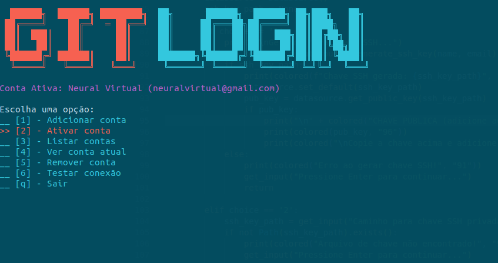

# Git Login Manager 🔐

Sistema completo para gerenciar múltiplas contas Git/GitHub com chaves SSH, permitindo alternar entre diferentes identidades facilmente.



## 🚀 Funcionalidades

- **Gerenciamento de múltiplas contas Git/GitHub**
- **Geração automática de chaves SSH**
- **Configuração automática do Git e SSH**
- **Interface de terminal interativa com navegação por setas**
- **Alternância rápida entre contas**
- **Teste de conectividade SSH**
- **Armazenamento seguro das configurações**

## 📋 Pré-requisitos

- Python 3.6+
- Git
- OpenSSH
- Sistema Linux/macOS

## 🔧 Instalação

### Método 1: Instalação Automática (Recomendado)

1. **Clone ou baixe o código**
2. **Execute o instalador:**
   ```bash
   python3 setup.py
   ```
3. **Reinicie o terminal ou execute:**
   ```bash
   source ~/.bashrc
   ```

### Método 2: Instalação Manual

1. **Crie a estrutura de diretórios:**
   ```bash
   mkdir -p ~/.git-login/app
   touch ~/.git-login/app/__init__.py
   ```

2. **Coloque o arquivo `data_source.py` em `~/.git-login/app/`**

3. **Coloque o script principal como executável:**
   ```bash
   mkdir -p ~/.local/bin
   cp git-login.py ~/.local/bin/git-login
   chmod +x ~/.local/bin/git-login
   ```

4. **Adicione ao PATH (se necessário):**
   ```bash
   echo 'export PATH="$HOME/.local/bin:$PATH"' >> ~/.bashrc
   source ~/.bashrc
   ```

## 🎮 Como Usar

### Iniciando o programa
```bash
git-login
```

### Primeira configuração

1. **Execute o git-login**
2. **Escolha "Adicionar conta"**
3. **Digite seu nome e email**
4. **Escolha uma opção para chave SSH:**
   - **Gerar nova chave SSH** (recomendado para nova conta)
   - **Usar chave SSH existente**

5. **Se gerar nova chave:**
   - O programa mostrará a chave pública
   - Copie e cole no GitHub: **Settings → SSH and GPG keys → New SSH key**

### Navegação

- **↑/↓**: Navegar pelo menu
- **Enter**: Selecionar opção
- **q**: Sair

### Funcionalidades do Menu

1. **➕ Adicionar conta**: Cadastra nova conta Git/GitHub
2. **🔄 Ativar conta**: Alterna para uma conta existente
3. **📋 Listar contas**: Visualiza todas as contas cadastradas
4. **👤 Ver conta atual**: Mostra detalhes da conta ativa
5. **🗑️ Remover conta**: Remove conta do sistema
6. **🔗 Testar conexão**: Verifica conectividade SSH com GitHub
7. **🚪 Sair**: Finaliza o programa

## 📁 Estrutura de Arquivos

```
~/.git-login/
├── app/
│   ├── __init__.py
│   └── data_source.py
├── database.db
~/.ssh/
├── config (configuração SSH automática)
├── git-login-nome-usuario (chave privada)
└── git-login-nome-usuario.pub (chave pública)
```

## 🔧 Como Funciona

### Configuração Automática

Quando você ativa uma conta, o sistema:

1. **Configura o Git globalmente:**
   ```bash
   git config --global user.name "Seu Nome"
   git config --global user.email "seu@email.com"
   ```

2. **Atualiza o arquivo ~/.ssh/config:**
   ```
   Host github.com
       HostName github.com
       User git
       IdentityFile ~/.ssh/git-login-seu-nome
       IdentitiesOnly yes
   ```

3. **Todas as operações Git passam a usar automaticamente a conta ativa**

### Banco de Dados

As informações são armazenadas em SQLite local:
- **Nome e email da conta**
- **Caminho da chave SSH privada**
- **Status ativo/inativo**

## 🛠️ Exemplos de Uso

### Cenário: Trabalho e Pessoal

```bash
# 1. Adicionar conta do trabalho
git-login → Adicionar conta
Nome: João Silva Trabalho
Email: joao@empresa.com
Gerar nova chave SSH

# 2. Adicionar conta pessoal  
git-login → Adicionar conta
Nome: João Silva
Email: joao.silva@gmail.com
Gerar nova chave SSH

# 3. Alternar para conta trabalho
git-login → Ativar conta → Selecionar ID da conta trabalho

# 4. Fazer commit (usa automaticamente a conta ativa)
git add .
git commit -m "Commit do trabalho"
git push

# 5. Alternar para conta pessoal
git-login → Ativar conta → Selecionar ID da conta pessoal

# 6. Fazer commit pessoal
git add .
git commit -m "Projeto pessoal"
git push
```

## 🔍 Solução de Problemas

### Problema: "Permission denied (publickey)"

**Solução:**
1. Verifique se a chave pública está no GitHub
2. Teste a conexão: `git-login → Testar conexão`
3. Verifique permissões: `ls -la ~/.ssh/`

### Problema: Chave SSH não funciona

**Solução:**
1. Verifique se o arquivo existe: `ls -la ~/.ssh/git-login-*`
2. Teste manualmente: `ssh -T git@github.com`
3. Regenere a chave se necessário

### Problema: Git não reconhece a configuração

**Solução:**
1. Verifique a configuração atual:
   ```bash
   git config --global user.name
   git config --global user.email
   ```
2. Reative a conta: `git-login → Ativar conta`

## 🔐 Segurança

- **Chaves SSH geradas com ed25519** (algoritmo moderno e seguro)
- **Chaves armazenadas com permissões 600** (apenas o usuário pode ler)
- **Configuração SSH com IdentitiesOnly** (evita vazamento de chaves)
- **Dados armazenados localmente** (não enviados para serviços externos)

## 🤝 Contribuição

Sinta-se à vontade para:
- Reportar bugs
- Sugerir melhorias
- Enviar pull requests
- Compartilhar casos de uso

## 📝 Licença

Este projeto é de código aberto e livre para uso.

## 🆘 Suporte

Se encontrar problemas:
1. Verifique os pré-requisitos
2. Execute `git-login → Testar conexão`
3. Consulte a seção de solução de problemas
4. Abra uma issue se necessário

---

**Desenvolvido com ❤️ para simplificar o gerenciamento de múltiplas contas Git**